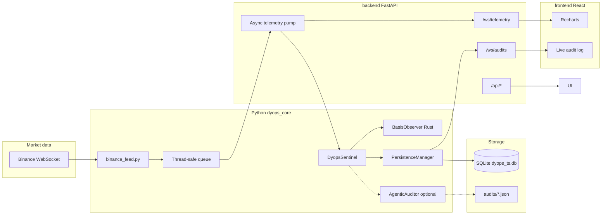

# Dyops Systems

Dyops is an **institutional-style tokenized-asset basis monitoring** platform. It combines a **Rust + PyO3 Kalman filter** (mean-reverting Ornstein–Uhlenbeck-style basis dynamics), a Python **sentinel** layer for breach detection and optional **Gemini** risk audits, **SQLite** persistence for telemetry and audits, **live market data** from Binance over WebSockets, and two operator surfaces: a **React + Vite** terminal backed by **FastAPI** (recommended) and a legacy **Streamlit** dashboard in `dyops_core/`.

This document is the **top-level guide** to the repository layout, architecture, configuration, and how to run everything. For Rust-only build notes and quick commands scoped to the Python package, see [`dyops_core/README.md`](dyops_core/README.md).

---

## What problem it solves

Tokenized assets (LSTs, stablecoin pairs, wrapped tokens) can drift from their reference **basis** (log-ratio of economically linked prices). Dyops:

1. **Ingests** paired prices (physical vs token, or stable vs peg) as a time series.
2. **Filters** the basis with a **state-space observer** (Kalman update with diagnostics).
3. **Flags** statistically unusual **innovations** (Mahalanobis-style distance vs the model).
4. **Escalates** to **AUDIT** when rolling **criticality** (fraction of recent samples in breach) crosses a threshold, optionally calling **Gemini** for a structured JSON risk report.
5. **Persists** each processed tick and each audit to **SQLite** for replay, compliance, and post-mortems.
6. **Streams** live results to browsers over **WebSockets** (FastAPI stack) or renders them in **Streamlit**.

---

## High-level architecture



**Control flow (FastAPI path):**

1. `binance_feed` runs an asyncio loop inside a **daemon thread**, reconnects with **exponential backoff**, and pushes `(timestamp, physical_price, token_price)` tuples onto a `queue.Queue`.
2. FastAPI’s **`_telemetry_pump`** asyncio task drains the queue and calls `DyopsSentinel.process_event(...)`.
3. `process_event` updates the Rust `BasisObserver`, evaluates breach / audit rules, and enqueues a row to **`PersistenceManager`** (background SQLite writer thread).
4. Each processed event is **broadcast** as JSON to all clients on **`/ws/telemetry`**.
5. New **audit** rows in SQLite are **polled** and broadcast on **`/ws/audits`**; connecting clients also receive a **snapshot** of recent audits. Gemini still writes **JSON files** under `dyops_core/audits/` when an auditor is configured.

---

## Repository layout

| Path | Role |
|------|------|
| [`dyops_core/`](dyops_core/) | **Rust crate** (PyO3 module `dyops_core`) and **Python modules**: `sentinel.py`, `database.py`, `binance_feed.py`, `dashboard.py`, tests/bench |
| [`dyops_core/src/`](dyops_core/src/) | `observer.rs` (filter, ring buffer, batch updates), `lib.rs` (PyO3 exports) |
| [`backend/main.py`](backend/main.py) | **FastAPI** app: lifespan, REST, WebSockets, integration with sentinel + feed + persistence |
| [`backend/requirements.txt`](backend/requirements.txt) | API-only pip deps (`fastapi`, `uvicorn[standard]`) — use together with `dyops_core` install |
| [`frontend/`](frontend/) | **Vite + React + TypeScript**, Tailwind, Recharts, shadcn-style UI primitives |

Generated / local artifacts (typically gitignored or not committed):

| Path | Role |
|------|------|
| `dyops_core/dyops_ts.db` (+ `-wal`, `-shm`) | SQLite time-series and audit mirror |
| `dyops_core/audits/*.json` | On-disk audit artifacts from Gemini (when enabled) |

---

## Core components (detail)

### 1. Rust `BasisObserver` (`dyops_core` Python package)

- **State** tracks basis, velocity, and mean level in a **critically damped OU**-style discrete model with mean-reversion speed **`theta`**.
- **`update(timestamp, physical_price, token_price)`** returns **`SystemHealth`**: `filtered_basis`, `innovation`, `mahalanobis_distance`, `measurement_valid`.
- **Joseph-form** covariance update helps keep covariances positive-semidefinite.
- **Ring buffer** stores recent innovations for **window statistics** (mean, variance, kurtosis) and **criticality** (percentage of samples with Mahalanobis above a threshold).
- **`update_batch`** is available for high-throughput batch ingestion (see `bench_batch.py`).

### 2. `DyopsSentinel` (`sentinel.py`)

- Wraps **`BasisObserver`** with policy:
  - **BREACH** when measurement is valid and **Mahalanobis distance** exceeds **`MAHALANOBIS_BREACH`** (default `3.0`).
  - **AUDIT** when **rolling criticality** over the last **`CRITICALITY_WINDOW_EVENTS`** exceeds **`CRITICALITY_AUDIT_PCT`** (default `15%`).
- **`process_event`** returns **`EventResult`**: `level` (`MONITORING` / `BREACH` / `AUDIT`), `health`, optional **`snapshot`** dict for the auditor, `criticality_recent_pct`.
- **`AgenticAuditor`** (optional): uses **`google-genai`**, default model from **`DYOPS_GEMINI_MODEL`** (`gemini-3-flash`). When an audit runs, results are saved as JSON files and, if **`PersistenceManager`** is wired, **`schedule_audit`** stores the full report in SQLite.

### 3. `PersistenceManager` (`database.py`)

- All writes go through a **single background thread** and a **queue**, so ingestion never blocks the telemetry loop.
- **Tables**
  - **`events`**: `timestamp`, `physical_price`, `token_price`, `innovation`, `mahalanobis_distance`
  - **`audits`**: `timestamp`, `event_id` (best-effort link to last event id at write time), `report_json` (full JSON including snapshot + Gemini payload when applicable)
- Helpers: **`load_recent_events`**, **`load_recent_audits`**, **`load_audits_after`**, **`count_events`**, **`get_max_audit_id`**.

### 4. `binance_feed.py`

- **Stable basis (default):** `usdcusdt@trade` → `physical_price = 1.0`, `token_price` = USDC price in USDT.
- **LST mode:** combined `ethusdt@trade` + `stethusdt@trade` → `(eth_usdt, steth_usdt)`.
- **Reconnect**: exponential backoff with cap (circuit-breaker style).
- Mode: environment **`DYOPS_BINANCE_FEED`** (`stable` vs `lst` / `steth` / etc.; see code for aliases).

### 5. Streamlit dashboard (`dashboard.py`)

- Optional **glass-style** UI: Plotly chart, metrics, sidebar audit cards, **JetBrains Mono** styling.
- Uses the same **Binance feed**, **sentinel**, and **persistence** patterns as the API (in-process). Suitable for quick demos without the React stack.

### 6. FastAPI backend (`backend/main.py`)

- On startup: open SQLite, **replay** the last 500 events into a fresh observer (state continuity), construct **`DyopsSentinel`** (with optional **`AgenticAuditor`** if API keys present), start the Binance thread.
- **`/ws/telemetry`**: server → client JSON messages `{"type":"telemetry","payload":{...}}` (full serialized event result plus `timestamp`, prices, `session_event_index`).
- **`/ws/audits`**: initial chronological batch, then live tail via DB polling.
- **REST**: `GET /api/status`, `/api/history`, `/api/pulse` — used by the React app (with Vite dev proxy).

### 7. React frontend (`frontend/`)

- **Dark**, flat finance aesthetic; **JetBrains Mono** for numeric emphasis.
- **Recharts** line chart (basis vs innovation) with **`isAnimationActive={false}`** and a capped buffer to reduce flicker under streaming load.
- **Top nav**: system pulse, Gemini badge, global event count (SQLite total), feed mode.
- **Layout**: ~70% chart, ~30% live audit log + compact table.

---

## Environment variables

| Variable | Purpose |
|----------|---------|
| `GEMINI_API_KEY` or `GOOGLE_API_KEY` | Enables **`AgenticAuditor`** when valid (optional) |
| `DYOPS_GEMINI_MODEL` | Gemini model id (default `gemini-3-flash`) |
| `DYOPS_SQLITE_PATH` | Override SQLite file path (default next to `database.py` in `dyops_core/`) |
| `DYOPS_BINANCE_FEED` | `stable` (default) vs LST aliases (`lst`, `steth`, …) |
| `DYOPS_CORS_ORIGINS` | Comma-separated origins for FastAPI CORS (default includes Vite dev server) |

---

## Prerequisites

- **Rust** (stable) and **Cargo** (for `maturin`)
- **Python** 3.10+
- **Node.js** 20+ (for the React app; use current LTS if possible)

---

## Installation and build

### 1. Python environment and native extension

From **`dyops_core/`**:

```bash
cd dyops_core
python -m venv .venv
source .venv/bin/activate   # Windows: .venv\Scripts\activate
pip install -U pip maturin
pip install -e .            # installs pyproject deps + prepares editable package
maturin develop --release    # builds and links the Rust dyops_core extension
```

`pip install -e .` pulls `numpy`, `loguru`, `google-genai`, `streamlit`, `plotly`, `websockets` per [`pyproject.toml`](dyops_core/pyproject.toml).

### 2. API server dependencies

From the **repository root** (same venv as above):

```bash
pip install -r backend/requirements.txt
```

### 3. Frontend dependencies

```bash
cd frontend
npm install
```

---

## How to run

### Recommended: FastAPI + React

**Terminal A** — API (from repo root, venv activated):

```bash
uvicorn backend.main:app --reload --host 127.0.0.1 --port 8000
```

**Terminal B** — UI:

```bash
cd frontend
npm run dev
```

Open **`http://localhost:5173`**. The Vite dev server **proxies** `/api` and `/ws` to **`http://127.0.0.1:8000`**.

### Alternative: Streamlit only

```bash
cd dyops_core
source .venv/bin/activate
streamlit run dashboard.py
```

### Production-style API (no reload)

```bash
uvicorn backend.main:app --host 0.0.0.0 --port 8000
```

Serve `frontend/dist` with any static host or CDN after `npm run build`, and set **`DYOPS_CORS_ORIGINS`** to your real origin.

---

## API reference (summary)

| Method / path | Description |
|-----------------|-------------|
| `GET /api/status` | Gemini configured, Binance feed mode, paths, SQLite event count |
| `GET /api/history?limit=` | Replay Kalman state over stored events; returns `t`, `basis`, `innovation`, `valid` |
| `GET /api/pulse` | Live vs stale feed, session tick count, SQLite total events |
| `WebSocket /ws/telemetry` | Stream of `EventResult`-shaped JSON per processed tick |
| `WebSocket /ws/audits` | Recent audits + live tail |

Open **`http://127.0.0.1:8000/docs`** when the server is running for interactive OpenAPI (REST only; WebSockets are described here).

---

## Data model notes

- **EventResult / telemetry**: includes nested **`health`**, optional large **`snapshot`** on AUDIT-level ticks (can increase WebSocket payload size).
- **SQLite `event_id`** on audits is **best-effort** (tied to writer state at insert time); for strict lineage, prefer timestamps and full `report_json`.
- **Replay**: both the FastAPI app and the dashboard **replay** stored events through a new observer on startup so the filter state matches continuity of stored prices (up to the replay window).

---

## Security and compliance

- **Never commit** API keys, `.env` files with secrets, or `audits/*.json` if they contain sensitive institutional data. Use `.gitignore` appropriately.
- **Binance** public market data only; you are responsible for network policies, IP allowlists, and terms of use.
- **Gemini** calls send **snapshots** derived from internal telemetry; review data handling against your policies.
- **Export / compliance** features mentioned in Streamlit are **placeholders** until a formal signed-report pipeline exists.

---

## Testing and benchmarks

```bash
cd dyops_core
cargo test
source .venv/bin/activate
python bench_batch.py
```

`scenario_test.py` is an optional Matplotlib harness for synthetic scenarios.

---

## Contributing (brief)

- After changing **Rust**, run **`maturin develop --release`** from `dyops_core/`.
- Python modules under `dyops_core/` are imported by **`backend/main.py`** via `sys.path` insertion; keep imports resolvable from that folder.
- Frontend: follow existing Tailwind v4 and component patterns under `frontend/src/components/ui/`.

---

## License

If no `LICENSE` file is present in this repo, add one appropriate to your institution before external distribution.
