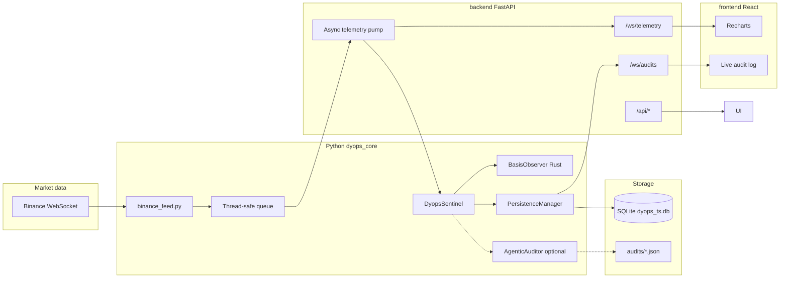

# Dyops Systems

Dyops is a **B2B-style tokenized-asset basis monitoring** stack: ingest paired prices, run a **Rust + PyO3 Kalman-style observer**, apply Python **sentinel** policies (Mahalanobis breach + rolling criticality), optionally escalate to **Gemini** audits, persist to **SQLite**, and expose everything through **FastAPI** (REST + WebSockets) and a **React + Vite** operator UI. **Deterministic replay explainability** (per-tick `reasoning`, pulse copy) is surfaced on the API for demos and integrations **without relying on Gemini**. A legacy **Streamlit** dashboard remains in [`dyops_core/dashboard.py`](dyops_core/dashboard.py).

This document is the **top-level guide** to layout, architecture, configuration, explainability endpoints, UX behavior, and how to run everything. Rust/build notes scoped to the Python package live in [`dyops_core/README.md`](dyops_core/README.md).

---

## What problem it solves

Tokenized assets (LSTs, stablecoin pairs, wrapped tokens) can drift from their reference **basis** (log-ratio of economically linked prices). Dyops:

1. **Ingests** paired prices (physical vs token, or stable vs peg) as a time series.
2. **Filters** the basis with a **state-space observer** (Kalman update with diagnostics).
3. **Flags** statistically unusual **innovations** (Mahalanobis-style distance vs the model).
4. **Escalates** to **AUDIT** when rolling **criticality** (fraction of recent samples in breach) crosses a threshold, optionally calling **Gemini** for a structured JSON risk report.
5. **Persists** each processed tick and each audit to **SQLite** for replay, compliance, and post-mortems.
6. **Streams** live results to browsers over **WebSockets** (FastAPI stack) or renders them in **Streamlit**.

---

## High-level architecture



**Control flow (FastAPI path):**

1. `binance_feed` runs an asyncio loop inside a **daemon thread**, reconnects with **exponential backoff**, and pushes `(timestamp, physical_price, token_price)` tuples onto a `queue.Queue`.
2. FastAPI’s **`_telemetry_pump`** asyncio task drains the queue and calls `DyopsSentinel.process_event(...)`.
3. `process_event` updates the Rust `BasisObserver`, evaluates breach / audit rules, and enqueues a row to **`PersistenceManager`** (background SQLite writer thread).
4. Each processed event is **broadcast** as JSON to all clients on **`/ws/telemetry`**.
5. New **audit** rows in SQLite are **polled** and broadcast on **`/ws/audits`**; connecting clients also receive a **snapshot** of recent audits. Gemini still writes **JSON files** under `dyops_core/audits/` when an auditor is configured.

---

## Repository layout

| Path | Role |
|------|------|
| [`dyops_core/`](dyops_core/) | **Rust crate** (PyO3 module `dyops_core`) and **Python modules**: `sentinel.py`, `database.py`, `binance_feed.py`, `dashboard.py`, tests/bench |
| [`dyops_core/src/`](dyops_core/src/) | `observer.rs` (filter, ring buffer, batch updates), `lib.rs` (PyO3 exports) |
| [`backend/main.py`](backend/main.py) | **FastAPI** app: lifespan, REST, WebSockets, integration with sentinel + feed + persistence |
| [`backend/requirements.txt`](backend/requirements.txt) | API-only pip deps (`fastapi`, `uvicorn[standard]`) — use together with `dyops_core` install |
| [`frontend/`](frontend/) | **Vite + React + TypeScript**, Tailwind v4, Recharts, shadcn-style UI primitives |
| [`frontend/src/App.tsx`](frontend/src/App.tsx) | Main dashboard: telemetry chart, audit column, pulse/trace explainability copy, telemetry WS reconnect |
| [`frontend/src/types/telemetry.ts`](frontend/src/types/telemetry.ts) | TS types for WebSocket payloads, chart points, **`PulseResponse`**, **`HistoryTraceBundle`** |
| [`frontend/src/index.css`](frontend/src/index.css) | Tailwind **`@theme`** tokens (“Calm Fintech Intel” palette / chart vars) |

Generated / local artifacts (typically gitignored or not committed):

| Path | Role |
|------|------|
| `dyops_core/dyops_ts.db` (+ `-wal`, `-shm`) | SQLite time-series and audit mirror |
| `dyops_core/audits/*.json` | On-disk audit artifacts from Gemini (when enabled) |

---

## Core components (detail)

### 1. Rust `BasisObserver` (`dyops_core` Python package)

- **State** tracks basis, velocity, and mean level in a **critically damped OU**-style discrete model with mean-reversion speed **`theta`**.
- **`update(timestamp, physical_price, token_price)`** returns **`SystemHealth`**: `filtered_basis`, `innovation`, `mahalanobis_distance`, `measurement_valid`.
- **Joseph-form** covariance update helps keep covariances positive-semidefinite.
- **Ring buffer** stores recent innovations for **window statistics** (mean, variance, kurtosis) and **criticality** (percentage of samples with Mahalanobis above a threshold).
- **`update_batch`** is available for high-throughput batch ingestion (see `bench_batch.py`).
- The **`update`** path is implemented in **Rust without GC**, which keeps **per-tick latency predictable** under continuous ingestion (see the comment above `BasisObserver::update` in [`dyops_core/src/observer.rs`](dyops_core/src/observer.rs)).

### 2. `DyopsSentinel` (`sentinel.py`)

- Wraps **`BasisObserver`** with policy:
  - **BREACH** when measurement is valid and **Mahalanobis distance** exceeds **`MAHALANOBIS_BREACH`** (default `3.0`).
  - **AUDIT** when **rolling criticality** over the last **`CRITICALITY_WINDOW_EVENTS`** exceeds **`CRITICALITY_AUDIT_PCT`** (default `15%`).
- **`process_event`** returns **`EventResult`**: `level` (`MONITORING` / `BREACH` / `AUDIT`), `health`, optional **`snapshot`** dict for the auditor, `criticality_recent_pct`.
- **`AgenticAuditor`** (optional): uses **`google-genai`**, default model from **`DYOPS_GEMINI_MODEL`** (`gemini-3-flash`). When an audit runs, results are saved as JSON files and, if **`PersistenceManager`** is wired, **`schedule_audit`** stores the full report in SQLite.

### 3. `PersistenceManager` (`database.py`)

- All writes go through a **single background thread** and a **queue**, so ingestion never blocks the telemetry loop.
- **Tables**
  - **`events`**: `timestamp`, `physical_price`, `token_price`, `innovation`, `mahalanobis_distance`
  - **`audits`**: `timestamp`, `event_id` (best-effort link to last event id at write time), `report_json` (full JSON including snapshot + Gemini payload when applicable)
- Helpers: **`load_recent_events`**, **`load_recent_audits`**, **`load_audits_after`**, **`count_events`**, **`get_max_audit_id`**.

### 4. `binance_feed.py`

- **Stable basis (default):** `usdcusdt@trade` → `physical_price = 1.0`, `token_price` = USDC price in USDT.
- **LST mode:** combined `ethusdt@trade` + `stethusdt@trade` → `(eth_usdt, steth_usdt)`.
- **Reconnect**: exponential backoff with cap (circuit-breaker style).
- Mode: environment **`DYOPS_BINANCE_FEED`** (`stable` vs `lst` / `steth` / etc.; see code for aliases).

### 5. Streamlit dashboard (`dashboard.py`)

- Optional **glass-style** UI: Plotly chart, metrics, sidebar audit cards, **JetBrains Mono** styling.
- Uses the same **Binance feed**, **sentinel**, and **persistence** patterns as the API (in-process). Suitable for quick demos without the React stack.

### 6. FastAPI backend (`backend/main.py`)

The app is documented in OpenAPI with an explicit product line:

- **`description`**: *“High-fidelity telemetry API for monitoring digital asset basis risk and peg stability.”*

**Lifecycle**

- On startup: open SQLite, **replay** the last 500 events into a fresh observer (state continuity), construct **`DyopsSentinel`** (with optional **`AgenticAuditor`** if API keys present), start the Binance thread.

**WebSockets**

- **`/ws/telemetry`**: server → client JSON `{"type":"telemetry","payload":{...}}` (event result shaped like `EventResult`, plus `timestamp`, prices, `session_event_index`).
- **`/ws/audits`**: initial chronological batch (recent audits), then **live tail** via DB polling.

**REST**

- **`GET /api/status`** — configuration surface: Gemini, feed mode, paths, **`global_events_total_sqlite`**, **`mahalanobis_breach_threshold`** (matches [`MAHALANOBIS_BREACH`](dyops_core/sentinel.py) used in breach logic).
- **`GET /api/pulse`** — **typed** pulse response (`PulseResponse`): `live`, **`last_tick_age_sec`**, `events_session`, `events_total_sqlite`, plus human **`summary`** and **`explainability`** strings (≤ ~200 / ~280 chars after clipping). Stale is inferred when **no tick for ~12s**.
- **`GET /api/history?limit=`** — returns a **bare JSON array** of replay points (`HistoryPoint`): `t`, `measured_basis` (= ln(price ratio)), `filtered_basis`, `innovation`, `mahalanobis`, `valid`. Stable for charts and dumb consumers.
- **`GET /api/history/trace?limit=`** — same replay as `/api/history`, wrapped as **`HistoryTraceBundle`**: top-level **`summary`** + **`explainability`** for the window, plus **`points[]`** where each row extends `HistoryPoint` with deterministic **`reasoning`** (Mahalanobis vs threshold, validity). **Gemini does not populate this.**

**Explainability internals (replay)**

Replay walks SQLite rows through a **fresh** in-process `BasisObserver` (same pattern as `/api/history`). Per-row **`reasoning`** is computed with **`MAHALANOBIS_BREACH`** as the sentinel threshold—for example when breached and measurement is valid, copy includes Mahalanobis magnitude and **percent above threshold** (“σ” here is **product shorthand** for the normalized statistic, not an implied Gaussian claim). Invalid measurements get a withheld-measurement explanation.

### 7. React frontend (`frontend/`)

**Brand & chrome**

- **Calm “fintech intel”** dark UI (zinc/stone): surface tokens live in [`frontend/src/index.css`](frontend/src/index.css) (`--color-terminal`, `--color-panel`, `--color-signal-emerald`, chart slate/mahalanobis/threshold vars, etc.).
- **JetBrains Mono** for numeric emphasis (`.font-mono-nums`).
- **Header**: “DYOPS” + *Dyops: State-Space Intelligence Layer.* **`Methodology`** outline badge — native **`title`** tooltip: *Kalman-Filtered State Tracking vs. Static Thresholds*.
- **System pulse** (LIVE/STALE solid dot — **no** pulse animation or neon glow); **Gemini** badge; **global events** (SQLite total); feed mode badge.

**Telemetry chart (“Real-Time Telemetry”)**

- **Data**: Loads **`GET /api/history`**; live updates from **`/ws/telemetry`** (buffer up to **500** points server-side on the client).
- **Rolling draw window**: Only the trailing **`CHART_VISIBLE_POINTS`** (**120**) points are passed to **Recharts** so quiet stable feeds stay **visually readable** (scales react to recent behavior, not weeks of SQLite tail).
- **Left Y-axis** (`basis`): **measured basis** (muted slate), **filtered state** (Signal Emerald), **innovation / residual** (stone-soft). Domain uses finite samples with optional **robust percentile** band (≥30 points → 1st–99th + padding); **tiny spans** expand to **`BASIS_MIN_DISPLAY_SPAN`** so micro-drift isn’t flattened to a hairline.
- **Right Y-axis** (`mahal`): **Mahalanobis distance**; domain **`[0, max(breachThreshold, max_seen × 1.15)]`** with breach threshold from **`GET /api/status`**. Horizontal **criticality threshold** (`ReferenceLine`) matches sentinel breach cutoff.
- **X-axis**: if the visible window crosses a **calendar day**, tick labels prepend a short date.
- Charts use **`isAnimationActive={false}`** (no flashy transitions).

**Explainability surfaces**

- **`GET /api/pulse`**: **`summary` · `explainability`** concatenated under the telemetry card title (truncated/`line-clamp`, full text on **`title`** hover).
- **`GET /api/history/trace`**: **`summary`** + **`explainability`** under **Structural Drift Audit** (border-accent block). Gemini audit cards unchanged below.

**Resilience**

- Telemetry WebSocket: on **close/error**, a **full-width banner** appears under the header: *Live Stream Paused — Reconnecting to State-Space Engine…* Reconnect uses **capped exponential backoff** (1s → 2s → … max **30s**). Audits WebSocket is unchanged (single connection).

**Layout**

- ~**70%** chart, ~**30%** audit column + compact **Recent audit index** table.

---

## Environment variables

| Variable | Purpose |
|----------|---------|
| `GEMINI_API_KEY` or `GOOGLE_API_KEY` | Enables **`AgenticAuditor`** when valid (optional) |
| `DYOPS_GEMINI_MODEL` | Gemini model id (default `gemini-3-flash`) |
| `DYOPS_SQLITE_PATH` | Override SQLite file path (default next to `database.py` in `dyops_core/`) |
| `DYOPS_BINANCE_FEED` | `stable` (default) vs LST aliases (`lst`, `steth`, …) |
| `DYOPS_CORS_ORIGINS` | Comma-separated origins for FastAPI CORS (default includes Vite dev server) |

---

## Prerequisites

- **Rust** (stable) and **Cargo** (for `maturin`)
- **Python** 3.10+
- **Node.js** 20+ (for the React app; use current LTS if possible)

---

## Installation and build

### 1. Python environment and native extension

From **`dyops_core/`**:

```bash
cd dyops_core
python -m venv .venv
source .venv/bin/activate   # Windows: .venv\Scripts\activate
pip install -U pip maturin
pip install -e .            # installs pyproject deps + prepares editable package
maturin develop --release    # builds and links the Rust dyops_core extension
```

`pip install -e .` pulls `numpy`, `loguru`, `google-genai`, `streamlit`, `plotly`, `websockets` per [`pyproject.toml`](dyops_core/pyproject.toml).

### 2. API server dependencies

From the **repository root** (same venv as above):

```bash
pip install -r backend/requirements.txt
```

### 3. Frontend dependencies

```bash
cd frontend
npm install
```

---

## How to run

### Recommended: FastAPI + React

**Terminal A** — API (from repo root, venv activated):

```bash
uvicorn backend.main:app --reload --host 127.0.0.1 --port 8000
```

**Terminal B** — UI:

```bash
cd frontend
npm run dev
```

Open **`http://localhost:5173`**. The Vite dev server **proxies** `/api` and `/ws` to **`http://127.0.0.1:8000`**.

Smoke-check **`http://127.0.0.1:8000/docs`**: confirms the FastAPI **description**, **`PulseResponse`**, **`HistoryTraceBundle`**, and list-shaped **`HistoryPoint`** schemas match this README.

### Alternative: Streamlit only

```bash
cd dyops_core
source .venv/bin/activate
streamlit run dashboard.py
```

### Production-style API (no reload)

```bash
uvicorn backend.main:app --host 0.0.0.0 --port 8000
```

Serve `frontend/dist` with any static host or CDN after `npm run build`, and set **`DYOPS_CORS_ORIGINS`** to your real origin.

---

## API reference (detail)

Interactive docs: **`http://127.0.0.1:8000/docs`** (REST only; WebSockets are summarized below and in this README).

| Method / path | Role |
|---------------|------|
| `GET /api/status` | `gemini_configured`, `binance_feed`, `audits_dir`, `db_path`, `global_events_total_sqlite`, **`mahalanobis_breach_threshold`** |
| `GET /api/pulse` | **`PulseResponse`**: `live`, `last_tick_age_sec`, `events_session`, `events_total_sqlite`, **`summary`**, **`explainability`** |
| `GET /api/history?limit=` | **`HistoryPoint[]`**: `t`, `measured_basis`, `filtered_basis`, `innovation`, `mahalanobis`, `valid` |
| `GET /api/history/trace?limit=` | **`HistoryTraceBundle`**: `summary`, `explainability`, **`points`** (`HistoryTracePoint` = history fields + **`reasoning`**) |
| `WebSocket /ws/telemetry` | Live `EventResult`-shaped payloads per tick |
| `WebSocket /ws/audits` | Snapshot + live tail of SQLite audits |

**Compatibility note:** Integrations that expect a **raw array** from `/api/history` remain valid. Use **`/api/history/trace`** when you need **operator copy** or **per-tick reasoning** without touching Gemini.

---

## Data model notes

- **EventResult / telemetry**: includes nested **`health`**, optional large **`snapshot`** on AUDIT-level ticks (can increase WebSocket payload size).
- **SQLite `event_id`** on audits is **best-effort** (tied to writer state at insert time); for strict lineage, prefer timestamps and full `report_json`.
- **Replay**: both the FastAPI app and the dashboard **replay** stored events through a new observer on startup so the filter state matches continuity of stored prices (up to the replay window).
- **Chart vs trace**: the UI calls **`/api/history`** for the chart and **`/api/history/trace`** once on load for audit-column copy—two replays of the same window, acceptable for current scale; collapse to one request later if you add a `meta` query flag.

---

## Operator notes (stable feeds)

On **`stable`** (e.g. USDC/USDT), log-basis moves are **very small**. The UI’s **visible window** and **Y-axis floor** exist so live ticks produce **perceptible but calm** motion. Mahalanobis often sits **near zero** on a **0…threshold** scale; the series can look **subtle** even when the pipeline is healthy—use **tooltips**, **pulse `summary`**, and **`/api/history/trace`** breach counts to validate behavior.

---

## Security and compliance

- **Never commit** API keys, `.env` files with secrets, or `audits/*.json` if they contain sensitive institutional data. Use `.gitignore` appropriately.
- **Binance** public market data only; you are responsible for network policies, IP allowlists, and terms of use.
- **Gemini** calls send **snapshots** derived from internal telemetry; review data handling against your policies.
- **Export / compliance** features mentioned in Streamlit are **placeholders** until a formal signed-report pipeline exists.

---

## Testing and benchmarks

```bash
cd dyops_core
cargo test
source .venv/bin/activate
python bench_batch.py
```

`scenario_test.py` is an optional Matplotlib harness for synthetic scenarios.

---

## Contributing (brief)

- After changing **Rust**, run **`maturin develop --release`** from `dyops_core/`.
- Python modules under `dyops_core/` are imported by **`backend/main.py`** via `sys.path` insertion; keep imports resolvable from that folder.
- Explainability copy and string caps (`_PULSE_*_MAX`, `_HISTORY_*_MAX`) live near the top of [`backend/main.py`](backend/main.py); keep **`MAHALANOBIS_BREACH`** imported from **`sentinel`**, don’t drift literals.
- Frontend: Tailwind v4 and shadcn-style primitives under [`frontend/src/components/ui/`](frontend/src/components/ui/); chart **`CHART_VISIBLE_POINTS`**, **`BASIS_MIN_DISPLAY_SPAN`**, etc. live in **`App.tsx`**—tune there for quieter vs noisier feeds.

---

## License

If no `LICENSE` file is present in this repo, add one appropriate to your institution before external distribution.
