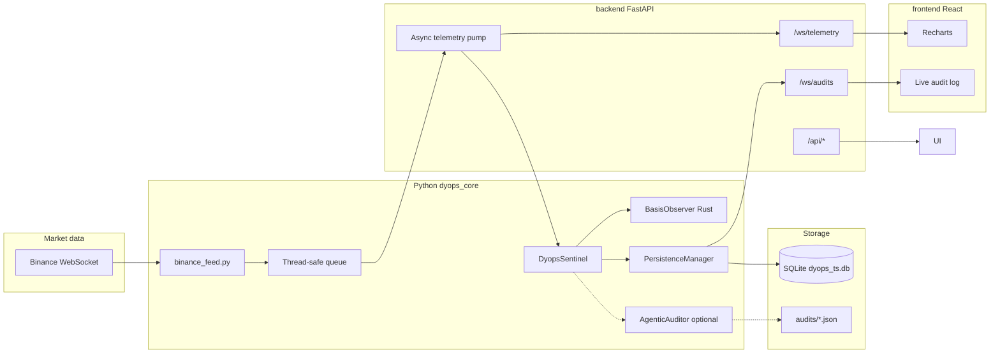

# Dyops Systems

## Product brief — for founders, BD, and technical partners

Dyops gives product and risk teams a **focused way to watch tokenized-asset basis and peg stability**: streamed prices, a **Rust-backed state-space filter**, explicit **Mahalanobis-style surprise** against that model, persistence for forensics, and **API-native explainability** operators can read without standing up a quant stack.

Partners typically embed monitoring **behind their own UX** (treasury, neo-bank ops, tokenized-asset products) and use Dyops as the **measurement and early-warning layer**.

> **An embeddable intelligence layer to monitor peg drift and basis risk without building your own quant-infra stack.**

**What “embeddable” means today:** production-style integration is via **`REST` (`/api/*`)** and **`WebSockets` (`/ws/*`)**, with an optional **React + Vite reference UI** (`frontend/`) for demos and internal ops. **Hosted multi-tenant SaaS, fine-grained API keys, and language-specific SDKs are not first-class in this repo yet** — see **[Next 90 days (planned)](#next-90-days-planned)**.

Deeper Rust/Python package notes live in [`dyops_core/README.md`](dyops_core/README.md).
The measurement, escalation, and validation boundaries are documented in
[`docs/METHODOLOGY.md`](docs/METHODOLOGY.md).

**CI runs the Rust tests and threshold-gated scenario suite on every pull request to `main`.**

---

## What Dyops does

- **Ingests** named paired instruments over concurrent **Binance WebSockets**, with one observer/sentinel state per instrument.
- **Filters** log-basis with a **`BasisObserver`** implemented in **Rust** (PyO3), exposed to Python — Kalman-style updates with **`filtered_basis`**, **`innovation`**, **`mahalanobis_distance`**, **`measurement_valid`**.
- **Policies** (`DyopsSentinel`): breach when Mahalanobis exceeds **`MAHALANOBIS_BREACH`** (default `3.0`); **AUDIT** when rolling **criticality** over a finite window crosses a configurable threshold.
- **Persists** ticks and audits to **SQLite** through a background writer (**`PersistenceManager`**).
- **Streams** live telemetry and audit tails over **`/ws/telemetry`** and **`/ws/audits`**; **replay** aligns observer state from stored events on startup.
- **Explainability:** **`GET /api/pulse`** exposes short **`summary`** / **`explainability`** strings; **`GET /api/history/trace`** returns window copy plus deterministic per-tick **`reasoning`** (no LLM — **Gemini does not populate this**).
- **Optional narrative audits:** **`AgenticAuditor`** (Gemini) when API keys are set — structured JSON (+ SQLite rows), surfaced in the React **Structural Drift Audit** column when configured.

**Boundary (read this once):** Dyops is **not** a regulated attestation service, SOC2-certified control, or substitute for legal/compliance sign-off. Deterministic **`reasoning`** on replay is **operational evidence-grade trace** (what the model saw and how it was classified) — **not** “regulatory proof” or legal advice.

---

## 5-Minute Partner Evaluation

Cold start → confirm value in three acts. **Ports:** API **8000**, Vite **5173** (proxies `/api` and `/ws` to the API).

### Cold start (copy-paste)

**One-time:** Rust + Python 3.10+ + Node 20+; from `dyops_core/`:

```bash
cd dyops_core
python -m venv .venv
source .venv/bin/activate   # Windows: .venv\Scripts\activate
pip install -U pip maturin
pip install -e .
maturin develop --release
```

Run the concise validation suite from `dyops_core/`:

```bash
python -m scenarios.run --all --quiet --summary
```

From **repo root** (same venv):

```bash
pip install -r backend/requirements.txt
```

From **`frontend/`**:

```bash
npm install
```

**Two terminals — API then UI:**

```bash
# Terminal A (repo root, venv on)
uvicorn backend.main:app --reload --host 127.0.0.1 --port 8000
```

```bash
# Terminal B
cd frontend && npm run dev
```

Open **`http://localhost:5173`**. Optional: **`http://127.0.0.1:8000/docs`** for OpenAPI (`PulseResponse`, `HistoryTraceBundle`, `HistoryPoint[]`).

---

### Act I — The Pulse (filtered state)

- **UI:** Header **System pulse** shows **LIVE** vs **STALE** (solid dot; stale ≈ **no tick for ~12s**). **Global events** reflects SQLite event count.
- **UI:** Card **Real-Time Telemetry** — under the title, copy from **`GET /api/pulse`** fields **`summary`** · **`explainability`** (hover for full text).
- **UI:** Chart — **Filtered state** (emerald), **Measured basis** (slate), **Innovation (residual)** (stone) — live points from **`/ws/telemetry`** after history loads from **`GET /api/history`**.
- **API:** `GET http://127.0.0.1:8000/api/pulse` — `live`, `last_tick_age_sec`, `events_session`, `events_total_sqlite`, `summary`, `explainability`.

---

### Act II — The Drift (anomaly / statistical surprise)

- **UI:** Same chart — right axis **Mahalanobis distance**; dashed **Criticality threshold** matches **`mahalanobis_breach_threshold`** from **`GET /api/status`** (aligned with **`MAHALANOBIS_BREACH`** in [`dyops_core/sentinel.py`](dyops_core/sentinel.py)).
- **UI:** **Structural Drift Audit** — top block: window **`summary`** and **`explainability`** from **`GET /api/history/trace`** (breach counts in natural language).
- **API:** `GET http://127.0.0.1:8000/api/history/trace?limit=500` — each point includes deterministic **`reasoning`** (Mahalanobis vs threshold, validity). **Not** Gemini-generated.

---

### Act III — The Audit trail (escalation & narrative)

- **UI:** **Structural Drift Audit** — scroll list + **Recent audit index** table; data from **`WebSocket /ws/audits`** (initial snapshot + live tail). **Gemini** badge **CONFIGURED** vs **OFFLINE** comes from **`GET /api/status`** (`gemini_configured`).
- **When Gemini is OFFLINE:** expect *“No Gemini audits yet.”* — escalation path and **`/api/history/trace`** reasoning still demonstrate **deterministic** monitoring; optional LLM is additive.
- **When configured:** audit cards show risk and narrative fields from stored reports (JSON + SQLite).

---

## Wedge: why teams reach for an API-native layer

| Dimension | Traditional / manual risk reporting | Dyops intelligence layer |
|-----------|-------------------------------------|---------------------------|
| **Cadence** | Batch reports, periodic reviews | **Streaming** ticks; pulse and telemetry update continuously |
| **Threshold logic** | Often static rules on raw prices | **State-space filter** + **Mahalanobis-style** surprise vs the model |
| **Integration** | Spreadsheets, decks, ad-hoc exports | **`REST` + `WebSockets`** first; embed in your services and SOCs |
| **Forensics** | Reconstructing “what we knew when” is manual | **SQLite replay** + **`/api/history/trace`** with per-tick **`reasoning`** |
| **Narration** | Human-written post-mortems | Optional **Gemini** audit JSON for structured narrative (when keys present) |

---

## Technical reference

### High-level architecture



**Control flow (FastAPI path):**

1. `binance_feed` runs an asyncio loop inside a **daemon thread**, reconnects with **exponential backoff**, and pushes `(timestamp, physical_price, token_price)` tuples onto a `queue.Queue`.
2. FastAPI’s **`_telemetry_pump`** asyncio task drains the queue and calls `DyopsSentinel.process_event(...)`.
3. `process_event` updates the Rust `BasisObserver`, evaluates breach / audit rules, and enqueues a row to **`PersistenceManager`** (background SQLite writer thread).
4. Each processed event is **broadcast** as JSON to all clients on **`/ws/telemetry`**.
5. New **audit** rows in SQLite are **polled** and broadcast on **`/ws/audits`**; connecting clients also receive a **snapshot** of recent audits. Gemini still writes **JSON files** under `dyops_core/audits/` when an auditor is configured.

---

### What problem it solves

Tokenized assets (LSTs, stablecoin pairs, wrapped tokens) can drift from their reference **basis** (log-ratio of economically linked prices). Dyops concentrates on **continuous monitoring**, **structured surprise**, and **durable replay** so operators can react and reconstruct state without rebuilding quant infrastructure.

---

### Repository layout

| Path | Role |
|------|------|
| [`dyops_core/`](dyops_core/) | **Rust crate** (PyO3 module `dyops_core`) and **Python modules**: `sentinel.py`, `database.py`, `binance_feed.py`, `dashboard.py`, tests/bench |
| [`dyops_core/src/`](dyops_core/src/) | `observer.rs` (filter, ring buffer, batch updates), `sentinel.rs` (breach/audit policy), `lib.rs` (PyO3 exports) |
| [`dyops_core/scenarios/`](dyops_core/scenarios/) | Deterministic market and feed stress scenarios, threshold definitions, and CLI runner |
| [`dyops_core/tests/`](dyops_core/tests/) | Python unit, sentinel-policy, replay, and scenario-threshold tests |
| [`backend/main.py`](backend/main.py) | **FastAPI** app: lifespan, REST, WebSockets, integration with sentinel + feed + persistence |
| [`backend/requirements.txt`](backend/requirements.txt) | API-only pip deps (`fastapi`, `uvicorn[standard]`) — use together with `dyops_core` install |
| [`frontend/`](frontend/) | **Vite + React + TypeScript**, Tailwind v4, Recharts, shadcn-style UI primitives |
| [`frontend/src/App.tsx`](frontend/src/App.tsx) | Main dashboard: telemetry chart, audit column, pulse/trace explainability copy, telemetry WS reconnect |
| [`frontend/src/types/telemetry.ts`](frontend/src/types/telemetry.ts) | TS types for WebSocket payloads, chart points, **`PulseResponse`**, **`HistoryTraceBundle`** |
| [`frontend/src/index.css`](frontend/src/index.css) | Tailwind **`@theme`** tokens (“Calm Fintech Intel” palette / chart vars) |
| [`docs/`](docs/) | Methodology and validation-boundary documentation |
| [`reports/`](reports/) | Generated robustness evidence in partner-readable Markdown and machine-readable JSON |
| [`scripts/`](scripts/) | Report-generation and repository utility scripts |
| [`.github/workflows/`](.github/workflows/) | Pull-request and `main` validation workflows |

Generated / local artifacts (typically gitignored or not committed):

| Path | Role |
|------|------|
| `dyops_core/dyops_ts.db` (+ `-wal`, `-shm`) | SQLite time-series and audit mirror |
| `dyops_core/audits/*.json` | On-disk audit artifacts from Gemini (when enabled) |

---

### Core components (detail)

#### 1. Rust `BasisObserver` (`dyops_core` Python package)

- **State** tracks basis, velocity, and mean level in a **critically damped OU**-style discrete model with mean-reversion speed **`theta`**.
- **`update(timestamp, physical_price, token_price)`** returns **`SystemHealth`**: `filtered_basis`, `innovation`, `mahalanobis_distance`, `measurement_valid`.
- **Joseph-form** covariance update helps keep covariances positive-semidefinite.
- **Ring buffer** stores recent innovations for **window statistics** (mean, variance, kurtosis) and **criticality** (percentage of samples with Mahalanobis above a threshold).
- **`update_batch`** is available for high-throughput batch ingestion (see `bench_batch.py`).
- The **`update`** path is implemented in **Rust without GC**, which keeps **per-tick latency predictable** under continuous ingestion (see the comment above `BasisObserver::update` in [`dyops_core/src/observer.rs`](dyops_core/src/observer.rs)).

#### 2. `DyopsSentinel` (`sentinel.py`)

- Thin Python integration wrapper around Rust **`DyopsSentinelCore`**, which owns the **`BasisObserver`** and policy:
  - **BREACH** when measurement is valid and **Mahalanobis distance** exceeds **`MAHALANOBIS_BREACH`** (default `3.0`).
  - **AUDIT** when **rolling criticality** over the last **`CRITICALITY_WINDOW_EVENTS`** exceeds **`CRITICALITY_AUDIT_PCT`** (default `15%`).
  - **AUDIT snapshot cooldown** defaults to **`AUDIT_COOLDOWN_TICKS=25`**, limiting repeated snapshots during a sustained AUDIT state to one every 25 processed ticks.
- Python retains persistence, operational logging, callbacks, and optional Gemini dispatch.
- **`process_event`** returns **`EventResult`**: `level` (`MONITORING` / `BREACH` / `AUDIT`), `health`, optional **`snapshot`** dict for the auditor, `criticality_recent_pct`.
- **`AgenticAuditor`** (optional): uses **`google-genai`**, default model from **`DYOPS_GEMINI_MODEL`** (`gemini-3-flash`). When an audit runs, results are saved as JSON files and, if **`PersistenceManager`** is wired, **`schedule_audit`** stores the full report in SQLite.

#### 3. `PersistenceManager` (`database.py`)

- All writes go through a **single background thread** and a **queue**, so ingestion never blocks the telemetry loop.
- **Tables**
  - **`events`**: `timestamp`, `physical_price`, `token_price`, `innovation`, `mahalanobis_distance`
  - **`audits`**: `timestamp`, `event_id` (best-effort link to last event id at write time), `report_json` (full JSON including snapshot + Gemini payload when applicable)
- Helpers: **`load_recent_events`**, **`load_recent_audits`**, **`load_audits_after`**, **`count_events`**, **`get_max_audit_id`**.

#### 4. `binance_feed.py`

- **Stable basis (default):** `usdcusdt@trade` → `physical_price = 1.0`, `token_price` = USDC price in USDT.
- **LST mode:** combined `ethusdt@trade` + `stethusdt@trade` → `(eth_usdt, steth_usdt)`.
- **Reconnect**: exponential backoff with cap (circuit-breaker style).
- Mode: environment **`DYOPS_BINANCE_FEED`** (`stable` vs `lst` / `steth` / etc.; see code for aliases).

#### 5. Streamlit dashboard (`dashboard.py`)

- Optional **glass-style** UI: Plotly chart, metrics, sidebar audit cards, **JetBrains Mono** styling.
- Uses the same **Binance feed**, **sentinel**, and **persistence** patterns as the API (in-process). Suitable for quick demos without the React stack.

#### 6. FastAPI backend (`backend/main.py`)

The app is documented in OpenAPI with an explicit product line:

- **`description`**: *“High-fidelity telemetry API for monitoring digital asset basis risk and peg stability.”*

**Lifecycle**

- On startup: open SQLite, **replay** the last 500 events into a fresh observer (state continuity), construct **`DyopsSentinel`** (with optional **`AgenticAuditor`** if API keys present), start the Binance thread.

**WebSockets**

- **`/ws/telemetry`**: server → client JSON `{"type":"telemetry","payload":{...}}` (event result shaped like `EventResult`, plus `timestamp`, prices, `session_event_index`).
- **`/ws/audits`**: initial chronological batch (recent audits), then **live tail** via DB polling.

**REST**

- **`GET /api/status`** — configuration surface: Gemini, feed mode, paths, **`global_events_total_sqlite`**, **`mahalanobis_breach_threshold`** (matches [`MAHALANOBIS_BREACH`](dyops_core/sentinel.py) used in breach logic).
- **`GET /api/pulse`** — **typed** pulse response (`PulseResponse`): `live`, **`last_tick_age_sec`**, `events_session`, `events_total_sqlite`, plus human **`summary`** and **`explainability`** strings (≤ ~200 / ~280 chars after clipping). Stale is inferred when **no tick for ~12s**.
- **`GET /api/history?limit=`** — returns a **bare JSON array** of replay points (`HistoryPoint`): `t`, `measured_basis` (= ln(price ratio)), `filtered_basis`, `innovation`, `mahalanobis`, `valid`. Stable for charts and dumb consumers.
- **`GET /api/history/trace?limit=`** — same replay as `/api/history`, wrapped as **`HistoryTraceBundle`**: top-level **`summary`** + **`explainability`** for the window, plus **`points[]`** where each row extends `HistoryPoint` with deterministic **`reasoning`** (Mahalanobis vs threshold, validity). **Gemini does not populate this.**

**Explainability internals (replay)**

Replay walks SQLite rows through a **fresh** in-process `BasisObserver` (same pattern as `/api/history`). Per-row **`reasoning`** is computed with **`MAHALANOBIS_BREACH`** as the sentinel threshold—for example when breached and measurement is valid, copy includes Mahalanobis magnitude and **percent above threshold** (“σ” here is **product shorthand** for the normalized statistic, not an implied Gaussian claim). Invalid measurements get a withheld-measurement explanation.

#### 7. React frontend (`frontend/`)

**Brand & chrome**

- **Calm “fintech intel”** dark UI (zinc/stone): surface tokens live in [`frontend/src/index.css`](frontend/src/index.css) (`--color-terminal`, `--color-panel`, `--color-signal-emerald`, chart slate/mahalanobis/threshold vars, etc.).
- **JetBrains Mono** for numeric emphasis (`.font-mono-nums`).
- **Header**: “DYOPS” + *Dyops: State-Space Intelligence Layer.* **`Methodology`** outline badge — native **`title`** tooltip: *Kalman-Filtered State Tracking vs. Static Thresholds*.
- **System pulse** (LIVE/STALE solid dot — **no** pulse animation or neon glow); **Gemini** badge; **global events** (SQLite total); feed mode badge.

**Telemetry chart (“Real-Time Telemetry”)**

- **Data**: Loads **`GET /api/history`**; live updates from **`/ws/telemetry`** (buffer up to **500** points server-side on the client).
- **Rolling draw window**: Only the trailing **`CHART_VISIBLE_POINTS`** (**120**) points are passed to **Recharts** so quiet stable feeds stay **visually readable** (scales react to recent behavior, not weeks of SQLite tail).
- **Left Y-axis** (`basis`): **measured basis** (muted slate), **filtered state** (Signal Emerald), **innovation / residual** (stone-soft). Domain uses finite samples with optional **robust percentile** band (≥30 points → 1st–99th + padding); **tiny spans** expand to **`BASIS_MIN_DISPLAY_SPAN`** so micro-drift isn’t flattened to a hairline.
- **Right Y-axis** (`mahal`): **Mahalanobis distance**; domain **`[0, max(breachThreshold, max_seen × 1.15)]`** with breach threshold from **`GET /api/status`**. Horizontal **criticality threshold** (`ReferenceLine`) matches sentinel breach cutoff.
- **X-axis**: if the visible window crosses a **calendar day**, tick labels prepend a short date.
- Charts use **`isAnimationActive={false}`** (no flashy transitions).

**Explainability surfaces**

- **`GET /api/pulse`**: **`summary` · `explainability`** concatenated under the telemetry card title (truncated/`line-clamp`, full text on **`title`** hover).
- **`GET /api/history/trace`**: **`summary`** + **`explainability`** under **Structural Drift Audit** (border-accent block). Gemini audit cards unchanged below.

**Resilience**

- Telemetry WebSocket: on **close/error**, a **full-width banner** appears under the header: *Live Stream Paused — Reconnecting to State-Space Engine…* Reconnect uses **capped exponential backoff** (1s → 2s → … max **30s**). Audits WebSocket is unchanged (single connection).

**Layout**

- ~**70%** chart, ~**30%** audit column + compact **Recent audit index** table.

---

### Environment variables

| Variable | Purpose |
|----------|---------|
| `GEMINI_API_KEY` or `GOOGLE_API_KEY` | Enables **`AgenticAuditor`** when valid (optional) |
| `DYOPS_GEMINI_MODEL` | Gemini model id (default `gemini-3-flash`) |
| `DYOPS_SQLITE_PATH` | Override SQLite file path (default next to `database.py` in `dyops_core/`) |
| `DYOPS_BINANCE_FEED` | `stable` (default) vs LST aliases (`lst`, `steth`, …) |
| `DYOPS_INSTRUMENTS` | Registry as presets (`stable,lst`) or a JSON array of ids, labels, feed modes, symbols, and synthetic flags |
| `DYOPS_INSTRUMENT_ID` | Backward-compatible single-feed id when `DYOPS_INSTRUMENTS` is unset (default `default`) |
| `DYOPS_INSTRUMENT_LABEL` | Optional label for the backward-compatible single feed |
| `DYOPS_CORS_ORIGINS` | Comma-separated origins for FastAPI CORS (default includes Vite dev server) |
| `DYOPS_WEBHOOK_URLS` | Optional comma-separated partner webhook URLs |
| `DYOPS_INSTRUMENT_ID` | Instrument label included in webhook payloads (default `default`) |

---

### Prerequisites

- **Rust** (stable) and **Cargo** (for `maturin`)
- **Python** 3.10+
- **Node.js** 20+ (for the React app; use current LTS if possible)

---

### Installation and build

#### 1. Python environment and native extension

From **`dyops_core/`**:

```bash
cd dyops_core
python -m venv .venv
source .venv/bin/activate   # Windows: .venv\Scripts\activate
pip install -U pip maturin
pip install -e .            # installs pyproject deps + prepares editable package
maturin develop --release    # builds and links the Rust dyops_core extension
```

`pip install -e .` pulls `numpy`, `loguru`, `google-genai`, `streamlit`, `plotly`, `websockets` per [`pyproject.toml`](dyops_core/pyproject.toml).

#### 2. API server dependencies

From the **repository root** (same venv as above):

```bash
pip install -r backend/requirements.txt
```

#### 3. Frontend dependencies

```bash
cd frontend
npm install
```

---

### How to run

#### Recommended: FastAPI + React

**Terminal A** — API (from repo root, venv activated):

```bash
uvicorn backend.main:app --reload --host 127.0.0.1 --port 8000
```

**Terminal B** — UI:

```bash
cd frontend
npm run dev
```

Open **`http://localhost:5173`**. The Vite dev server **proxies** `/api` and `/ws` to **`http://127.0.0.1:8000`**.

Smoke-check **`http://127.0.0.1:8000/docs`**: confirms the FastAPI **description**, **`PulseResponse`**, **`HistoryTraceBundle`**, and list-shaped **`HistoryPoint`** schemas.

#### Alternative: Streamlit only

```bash
cd dyops_core
source .venv/bin/activate
streamlit run dashboard.py
```

#### Production-style API (no reload)

```bash
uvicorn backend.main:app --host 0.0.0.0 --port 8000
```

Serve `frontend/dist` with any static host or CDN after `npm run build`, and set **`DYOPS_CORS_ORIGINS`** to your real origin.

---

### API reference (detail)

Interactive docs: **`http://127.0.0.1:8000/docs`** (REST only; WebSockets are summarized below and in this README).

| Method / path | Role |
|---------------|------|
| `GET /api/instruments` | Instrument ids, labels, feed/symbol metadata, pulse state, and scoped event counts |
| `GET /api/status` | `gemini_configured`, `webhook_configured`, `binance_feed`, `audits_dir`, `db_path`, `global_events_total_sqlite`, **`mahalanobis_breach_threshold`** |
| `GET /api/pulse?instrument=` | Instrument-scoped freshness, counts, `summary`, and `explainability` |
| `GET /api/history?instrument=&limit=` | Instrument-scoped bare **`HistoryPoint[]`**, including `instrument_id` |
| `GET /api/history/trace?instrument=&limit=` | Instrument-scoped trace bundle with deterministic per-tick `reasoning` |
| `WebSocket /ws/telemetry` | Shared live stream; every payload includes `instrument_id` for client filtering |
| `WebSocket /ws/audits` | Snapshot + live tail of SQLite audits |

**Compatibility note:** Integrations that expect a **raw array** from `/api/history` remain valid. Use **`/api/history/trace`** when you need **operator copy** or **per-tick reasoning** without touching Gemini.

---

### Integration

Run both built-in feeds concurrently:

```bash
DYOPS_INSTRUMENTS=stable,lst uvicorn backend.main:app --host 0.0.0.0 --port 8000
```

For custom names and metadata, use a JSON array, for example `DYOPS_INSTRUMENTS='[{"id":"usdc-usdt","label":"USDC / USDT","feed_mode":"stable","physical_symbol":"USD","token_symbol":"USDCUSDT","synthetic":true},{"id":"eth-steth","label":"ETH / stETH","feed_mode":"lst","physical_symbol":"ETHUSDT","token_symbol":"STETHUSDT"}]'`. Thresholds remain global; observer state, SQLite history, pulse, and escalation routing are partitioned by instrument.

Set **`DYOPS_WEBHOOK_URLS`** to one or more comma-separated HTTPS webhook URLs. Dyops sends a JSON `POST` for every **BREACH** and for each cooldown-gated **AUDIT snapshot** (the first snapshot is immediate). Delivery runs outside the telemetry pump, has a 2-second HTTP timeout, and retries once on HTTP or network failure.

The payload contains `timestamp`, `level`, `mahalanobis`, `innovation`, `criticality_recent_pct`, `instrument_id`, and the pulse `summary` and `explainability` fields. It also contains `event_id` when an ID is already available; asynchronous SQLite writes mean it is normally omitted from live escalation payloads.

This integration uses plain HTTP webhooks through `httpx`; it does not require a Slack or partner-specific SDK. **`GET /api/status`** reports `webhook_configured: true` whenever at least one non-empty URL is configured.

---

### Data model notes

- **EventResult / telemetry**: includes nested **`health`**, optional large **`snapshot`** on AUDIT-level ticks (can increase WebSocket payload size).
- **SQLite `event_id`** on audits is **best-effort** (tied to writer state at insert time); for strict lineage, prefer timestamps and full `report_json`.
- **Replay**: both the FastAPI app and the dashboard **replay** stored events through a new observer on startup so the filter state matches continuity of stored prices (up to the replay window).
- **Chart vs trace**: the UI calls **`/api/history`** for the chart and **`/api/history/trace`** once on load for audit-column copy—two replays of the same window, acceptable for current scale; collapse to one request later if you add a `meta` query flag.

---

### Operator notes (stable feeds)

On **`stable`** (e.g. USDC/USDT), log-basis moves are **very small**. The UI’s **visible window** and **Y-axis floor** exist so live ticks produce **perceptible but calm** motion. Mahalanobis often sits **near zero** on a **0…threshold** scale; the series can look **subtle** even when the pipeline is healthy—use **tooltips**, **pulse `summary`**, and **`/api/history/trace`** breach counts to validate behavior.

---

### Security and compliance

- **Never commit** API keys, `.env` files with secrets, or `audits/*.json` if they contain sensitive institutional data. Use `.gitignore` appropriately.
- **Binance** public market data only; you are responsible for network policies, IP allowlists, and terms of use.
- **Gemini** calls send **snapshots** derived from internal telemetry; review data handling against your policies.
- **Export / compliance** features mentioned in Streamlit are **placeholders** until a formal signed-report pipeline exists.
- This README **does not** claim SOC 2, ISO, or regulatory approvals for Dyops as software.

---

### Testing and benchmarks

With the `dyops_core` virtual environment active, install the backend test
dependencies from the repository root:

```bash
pip install -r backend/requirements.txt pytest
```

Run the core Python unit tests from `dyops_core/`:

```bash
python -m unittest discover -s tests -v
```

Run the offline backend API contract tests from the repository root:

```bash
pytest backend/tests -q
```

```bash
cd dyops_core
cargo test
source .venv/bin/activate
python bench_batch.py
python -m scenarios.run --list
python -m scenarios.run --scenario slow_drift --json
python -m scenarios.run --all --quiet --summary
```

The headless scenario framework runs deterministic market and feed stresses through
the full `DyopsSentinel.process_event` policy path, checks replay and scenario
thresholds, and can emit strict JSON results.

Run validation:

```bash
cd dyops_core && python -m scenarios.run --all --quiet --summary
```

Generate the partner-facing robustness evidence from the repository root with the
virtual environment active:

```bash
python scripts/generate_robustness_report.py
```

Partner evidence pack: [`reports/robustness_report.md`](reports/robustness_report.md).

---

### Contributing (brief)

- After changing **Rust**, run **`maturin develop --release`** from `dyops_core/`.
- Python modules under `dyops_core/` are imported by **`backend/main.py`** via `sys.path` insertion; keep imports resolvable from that folder.
- Explainability copy and string caps (`_PULSE_*_MAX`, `_HISTORY_*_MAX`) live near the top of [`backend/main.py`](backend/main.py); keep **`MAHALANOBIS_BREACH`** imported from **`sentinel`**, don’t drift literals.
- Frontend: Tailwind v4 and shadcn-style primitives under [`frontend/src/components/ui/`](frontend/src/components/ui/); chart **`CHART_VISIBLE_POINTS`**, **`BASIS_MIN_DISPLAY_SPAN`**, etc. live in **`App.tsx`**—tune there for quieter vs noisier feeds.

---

## Next 90 days (planned)

Everything below is **roadmap**, not shipped in-repo unless separately noted:

- **Multi-tenant auth / per-tenant API keys** — partition access and metering for partner deployments.
- **Hosted vs BYO** — clarify packaging: customer VPC / single-tenant SaaS versus self-hosted bundle (Docker Compose / Helm TBD).

---

## License

If no `LICENSE` file is present in this repo, add one appropriate to your institution before external distribution.
